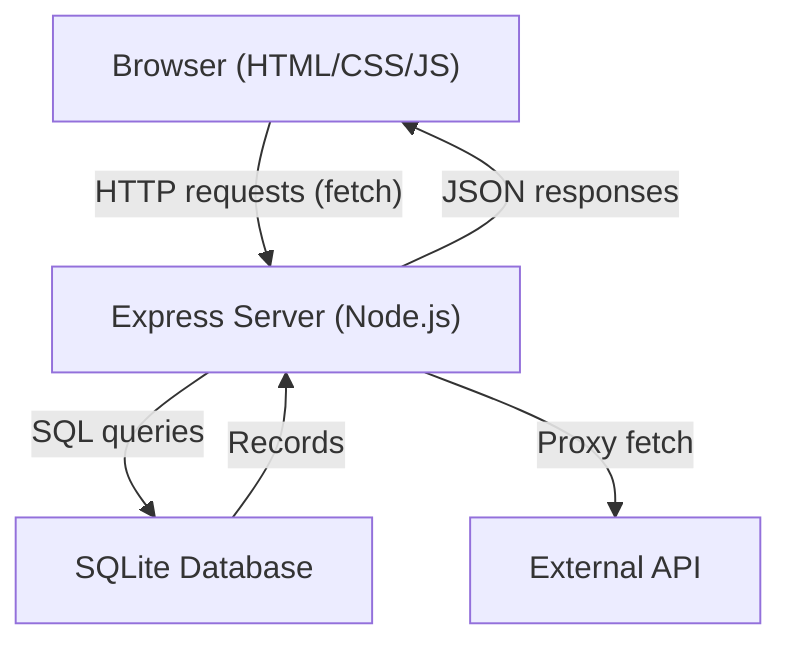

# Design Document: Attendance System Website

## Overview

The Attendance System Website is a multi-page web application with a Node.js/Express backend and a SQLite database. Users can browse public pages (Home, About, Contact), log in to access protected attendance data, and interact with live API data. The frontend is built with vanilla HTML, CSS3, and JavaScript; the backend exposes a REST API consumed by the frontend via `fetch()`.

The system is split into two layers:
- **Frontend**: Static HTML pages served by Express, with shared CSS and JS modules
- **Backend**: Express routes handling authentication, database queries, and API proxying

---

## Architecture



### Page Structure

```
/
├── public/
│   ├── index.html        (Home)
│   ├── about.html        (About)
│   ├── contact.html      (Contact)
│   ├── login.html        (Login)
│   ├── dashboard.html    (Authenticated attendance view)
│   ├── css/
│   │   └── styles.css
│   └── js/
│       ├── nav.js        (active link highlighting)
│       ├── validator.js  (form validation)
│       ├── api-client.js (fetch wrapper)
│       └── dashboard.js  (attendance data rendering)
├── server.js             (Express entry point)
├── routes/
│   ├── auth.js           (login/register endpoints)
│   └── attendance.js     (attendance data endpoints)
├── db/
│   └── database.js       (SQLite connection + schema init)
└── package.json
```

---

## Components and Interfaces

### Frontend Components

#### Navigation Bar (`nav.js`)
- Rendered in every HTML page via a shared `<nav>` element
- On `DOMContentLoaded`, compares `window.location.pathname` to each link's `href` and adds an `active` class to the matching link
- Interface: none (self-contained DOM manipulation)

#### Validator (`validator.js`)
Exported functions:
```js
validateContactForm(name, email): { valid: boolean, errors: string[] }
validateLoginForm(username, password): { valid: boolean, errors: string[] }
```
- `validateContactForm`: checks name is non-empty (after trim), email matches RFC-5322-like regex
- `validateLoginForm`: checks both fields are non-empty after trim

#### API Client (`api-client.js`)
```js
async fetchAttendanceData(): Promise<AttendanceRecord[]>
```
- Calls `GET /api/attendance-feed` on the backend
- On success: returns parsed JSON array
- On failure: throws an `Error` with a descriptive message

#### Dashboard (`dashboard.js`)
- Calls `fetchAttendanceData()` on page load
- Renders records into a `<table>` in `#attendance-container`
- On error: renders error message into `#attendance-container`

### Backend Components

#### Express Server (`server.js`)
- Serves static files from `/public`
- Mounts `/api/auth` and `/api/attendance` routers
- Uses `express-session` for session management
- Middleware: `express.json()`, session middleware, auth guard for `/dashboard.html`

#### Auth Router (`routes/auth.js`)
| Method | Path | Description |
|--------|------|-------------|
| POST | `/api/auth/login` | Validate credentials, create session |
| POST | `/api/auth/register` | Hash password, insert user record |
| POST | `/api/auth/logout` | Destroy session |
| GET | `/api/auth/me` | Return current session user |

#### Attendance Router (`routes/attendance.js`)
| Method | Path | Description |
|--------|------|-------------|
| GET | `/api/attendance` | Return attendance records for authenticated user |
| GET | `/api/attendance-feed` | Proxy fetch to external API, return JSON |

#### Database Module (`db/database.js`)
```js
initDB(): void          // creates tables if not exist
getDB(): Database       // returns better-sqlite3 instance
```

---

## Data Models

### User Record (SQLite)
```sql
CREATE TABLE users (
  id        INTEGER PRIMARY KEY AUTOINCREMENT,
  username  TEXT    NOT NULL UNIQUE,
  email     TEXT    NOT NULL UNIQUE,
  password  TEXT    NOT NULL,   -- bcrypt hash
  created_at TEXT   DEFAULT (datetime('now'))
);
```

### Attendance Record (SQLite)
```sql
CREATE TABLE attendance (
  id         INTEGER PRIMARY KEY AUTOINCREMENT,
  user_id    INTEGER NOT NULL REFERENCES users(id),
  date       TEXT    NOT NULL,  -- ISO 8601 date
  status     TEXT    NOT NULL CHECK(status IN ('present','absent','late')),
  created_at TEXT    DEFAULT (datetime('now'))
);
```

### Session (in-memory / express-session)
```js
req.session.userId   // integer, set on successful login
req.session.username // string
```

### API Response Shape (External Feed)
```ts
interface AttendanceRecord {
  id: number
  date: string       // ISO 8601
  status: string
  name?: string
}
```

### Contact Form Payload (client-side only, not persisted)
```js
{ name: string, email: string }
```

---

## Correctness Properties

*A property is a characteristic or behavior that should hold true across all valid executions of a system — essentially, a formal statement about what the system should do. Properties serve as the bridge between human-readable specifications and machine-verifiable correctness guarantees.*


### Property 1: Valid contact form is accepted

*For any* non-empty name string (after trimming whitespace) and any properly formatted email address string, calling `validateContactForm(name, email)` should return `{ valid: true }` with no errors.

**Validates: Requirements 4.2**

### Property 2: Empty name is rejected

*For any* string composed entirely of whitespace (or the empty string) used as the name field, calling `validateContactForm(name, email)` should return `{ valid: false }` with a non-empty errors array containing a name-related error, regardless of the email value.

**Validates: Requirements 4.3**

### Property 3: Invalid email is rejected

*For any* string that does not conform to a valid email format used as the email field, calling `validateContactForm(name, email)` should return `{ valid: false }` with a non-empty errors array containing an email-related error, regardless of the name value.

**Validates: Requirements 4.4**

### Property 4: Active nav link matches current path

*For any* page pathname, after `nav.js` runs its active-link logic, exactly one navigation link should have the `active` CSS class, and that link's `href` should correspond to the current pathname.

**Validates: Requirements 2.4**

### Property 5: Dynamic text update without reload

*For any* string value passed to the dynamic text handler, the target DOM element's `textContent` should equal that string after the handler executes, and no page navigation or reload should occur.

**Validates: Requirements 6.3**

### Property 6: API response parse and render round-trip

*For any* valid JSON array of attendance records returned by the API, parsing the response as JSON and then rendering it should produce an HTML string that contains each record's `date` and `status` values.

**Validates: Requirements 7.2, 7.4**

### Property 7: API error produces descriptive message

*For any* failed fetch (network error or non-2xx HTTP status), the error handler should produce a non-empty, human-readable error message string that is displayed in the attendance container rather than leaving it blank.

**Validates: Requirements 7.3**

### Property 8: Login form empty-field validation

*For any* login form submission where the username or password field is empty or composed entirely of whitespace, calling `validateLoginForm(username, password)` should return `{ valid: false }` with a non-empty errors array before any network request is made.

**Validates: Requirements 8.4**

### Property 9: Valid credentials produce authenticated session

*For any* user record stored in the database, submitting a POST to `/api/auth/login` with that user's correct username and password should return HTTP 200 and set a session cookie identifying that user.

**Validates: Requirements 8.2**

### Property 10: Invalid credentials are rejected

*For any* login attempt where the submitted password does not match the stored bcrypt hash for the given username, the backend should return HTTP 401 with an error message body.

**Validates: Requirements 8.3**

### Property 11: Protected routes reject unauthenticated requests

*For any* HTTP request to a protected route (e.g., `/dashboard.html`, `/api/attendance`) that does not carry a valid session, the server should respond with HTTP 401 or redirect to the login page.

**Validates: Requirements 8.5**

### Property 12: User registration stores all required fields

*For any* valid registration payload `{ username, email, password }`, after a successful POST to `/api/auth/register`, querying the database for that username should return a record containing a unique `id`, the original `username`, the original `email`, and a bcrypt-hashed `password` (not the plaintext).

**Validates: Requirements 9.1, 9.2**

### Property 13: Attendance records round-trip through database

*For any* set of attendance records inserted for a user, a GET to `/api/attendance` while authenticated as that user should return all inserted records with matching `date` and `status` values.

**Validates: Requirements 9.4**

### Property 14: Database errors produce descriptive error responses

*For any* backend route where the database operation throws an exception, the HTTP response should have a non-2xx status code and a JSON body containing a non-empty `error` string.

**Validates: Requirements 9.5**

---

## Error Handling

### Frontend

| Scenario | Handling |
|----------|----------|
| Contact form empty name | Inline error message below name field; submission blocked |
| Contact form invalid email | Inline error message below email field; submission blocked |
| Login form empty fields | Inline error message; no fetch request sent |
| API fetch failure | Error message rendered in `#attendance-container` |
| Non-2xx API response | Same as fetch failure; message includes HTTP status |
| Unauthenticated dashboard access | Redirect to `login.html` via server middleware |

### Backend

| Scenario | HTTP Status | Response Body |
|----------|-------------|---------------|
| Invalid login credentials | 401 | `{ "error": "Invalid username or password" }` |
| Missing required fields | 400 | `{ "error": "All fields are required" }` |
| Username/email already exists | 409 | `{ "error": "Username or email already in use" }` |
| Database query failure | 500 | `{ "error": "Internal server error" }` |
| Unauthenticated protected route | 401 | `{ "error": "Authentication required" }` |

All backend route handlers wrap database calls in try/catch blocks. Errors are logged server-side and a sanitized message is returned to the client (no stack traces exposed).

---

## Testing Strategy

### Dual Testing Approach

Both unit tests and property-based tests are required. They are complementary:
- Unit tests catch concrete bugs at specific inputs and integration points
- Property tests verify general correctness across the full input space

### Unit Tests

Focus on:
- Specific examples: contact form with a known valid input, login page HTML structure, nav link presence
- Integration points: Express route handlers with a test database
- Edge cases: empty string vs. whitespace-only string in validators, missing JSON fields in API response

Example unit test targets:
- `validateContactForm("Alice", "alice@example.com")` returns `valid: true`
- `GET /api/auth/me` without session returns 401
- `POST /api/auth/register` with duplicate username returns 409
- Login page HTML contains `input[type=password]`

### Property-Based Tests

Use **fast-check** (JavaScript) for all property-based tests. Each test runs a minimum of **100 iterations**.

Each test must be tagged with a comment in this format:
```
// Feature: attendance-system-website, Property N: <property_text>
```

| Property | Test Description | Generator Inputs |
|----------|-----------------|-----------------|
| P1 | Valid contact form accepted | `fc.string({ minLength: 1 })` for name, valid email generator |
| P2 | Empty/whitespace name rejected | `fc.stringOf(fc.constantFrom(' ','\t','\n'))` for name |
| P3 | Invalid email rejected | arbitrary strings that fail email regex |
| P4 | Active nav link matches path | `fc.constantFrom('/index.html', '/about.html', '/contact.html')` |
| P5 | Dynamic text update | `fc.string()` for text value |
| P6 | API parse+render round-trip | `fc.array(fc.record({ date: fc.string(), status: fc.string() }))` |
| P7 | API error message non-empty | `fc.oneof(fc.constant('NetworkError'), fc.integer({min:400,max:599}))` |
| P8 | Login empty-field validation | `fc.constantFrom('', '   ', '\t')` for username or password |
| P9 | Valid credentials return 200 | Generated user records inserted into test DB |
| P10 | Invalid credentials return 401 | Generated wrong passwords |
| P11 | Protected routes reject unauth | Generated route paths from protected list |
| P12 | Registration stores all fields | `fc.record({ username, email, password })` with valid generators |
| P13 | Attendance round-trip | `fc.array(fc.record({ date, status }))` inserted then retrieved |
| P14 | DB errors return error response | Simulated DB exceptions via mock/stub |

### Test File Layout

```
tests/
├── unit/
│   ├── validator.test.js
│   ├── nav.test.js
│   ├── routes.auth.test.js
│   └── routes.attendance.test.js
└── property/
    ├── validator.prop.test.js
    ├── api-client.prop.test.js
    ├── auth.prop.test.js
    └── attendance.prop.test.js
```

Use **Jest** as the test runner for both unit and property tests. Run with:
```
npx jest --run
```
